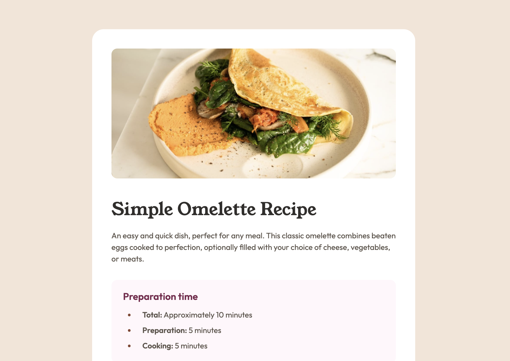

# Frontend Mentor - Recipe page solution

This is a solution to the [Recipe page challenge on Frontend Mentor](https://www.frontendmentor.io/challenges/recipe-page-KiTsR8QQKm). Frontend Mentor challenges help you improve your coding skills by building realistic projects.

## Table of contents

- [Overview](#overview)
  - [Screenshot](#screenshot)
  - [Links](#links)
  - [Built with](#built-with)
  - [What I learned](#what-i-learned)
- [Author](#author)

## Overview

My solution to the Frontend Mentor Recipe page challenge. This was a fun challenge in which I was able to put into practice some of the intricacies of styling lists and tables to a set design.

### Screenshot

### Links

- Solution URL: https://github.com/smartinuk88/recipe-page
- Live Site URL: https://recipe-page-gamma-five.vercel.app/

### Built with

- Semantic HTML5 markup
- CSS custom properties
- Flexbox
- CSS Grid
- Mobile-first workflow
- Media Queries

### What I learned

During this project, I learned how to style and layout different elements of lists and tables. For example, how to style the markers themselves, as well as how to add custom spacing between the marker and the beginning of the list item.

I also used grid-template-columns to aid in creating my desired table design.

## Author

- Website - https://www.scottmartinwebdevelopment.com
- Frontend Mentor - [@smartinuk88](https://www.frontendmentor.io/profile/smartinuk88)
